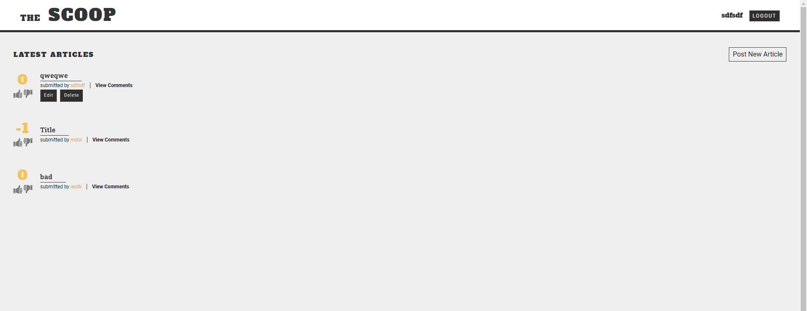
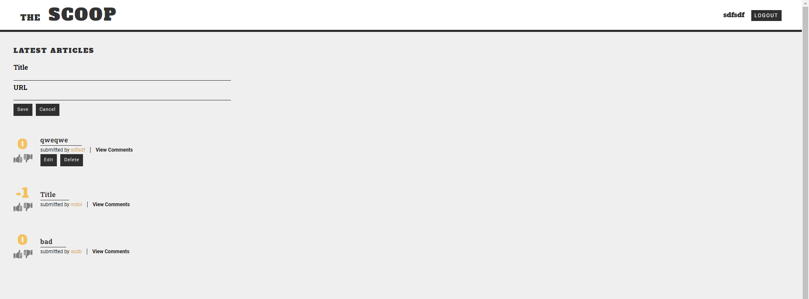
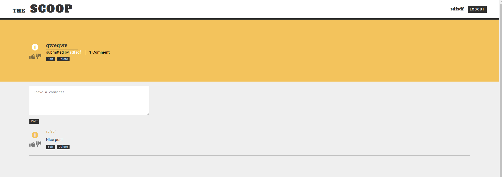

# The Scoop

A project from Codecademy: [Create a Back-End App with JavaScript](https://www.codecademy.com/learn/paths/create-a-back-end-app-with-javascript) skill path.

## Project Prompt

In this project, you will build all of the routing and database logic for an article submission web app called The Scoop.

The Scoop allows users to:
- Create and log in to custom username handles
- Submit, edit, and delete articles containing a link and description
- Upvote and downvote articles
- Create, edit, and delete comments on articles
- Upvote and downvote comments
- View all of a user's articles and comments

## Screenshots

  

  
